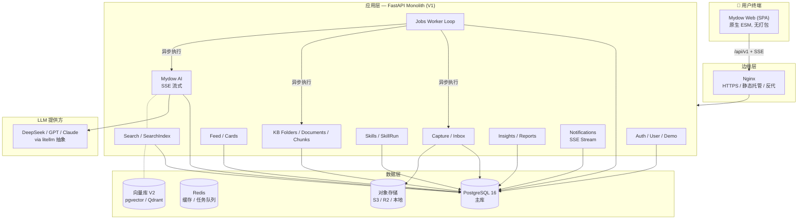
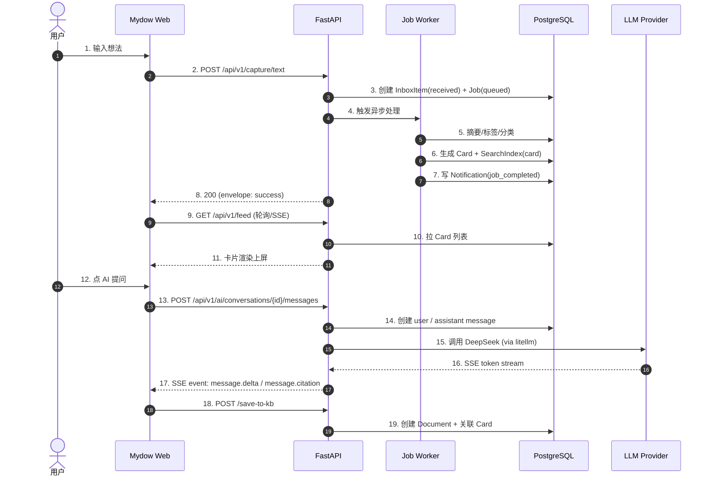
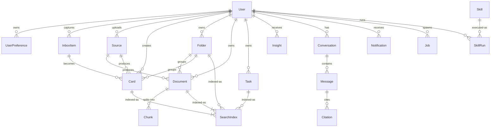
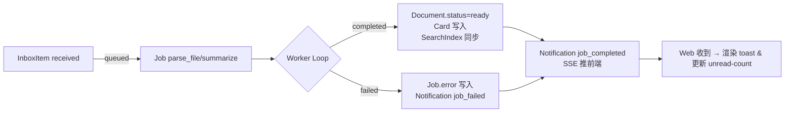
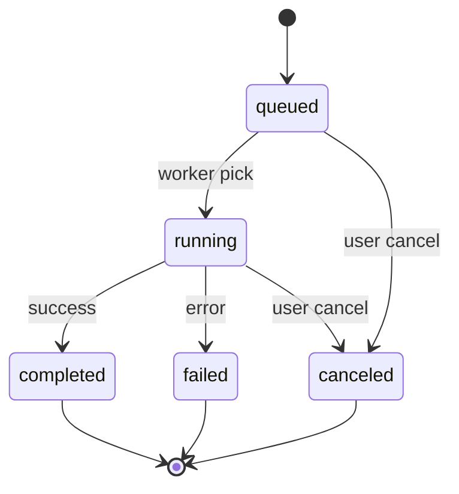
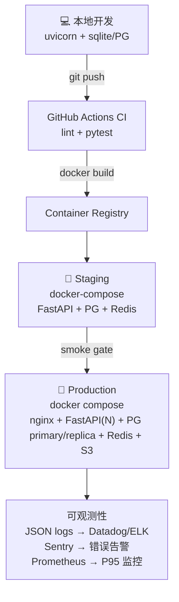

# Mydow / PRD10 系统架构

> 版本：与 PRD10 V1 对齐。
> 更新：2026-05-05。

本文档给投资人、新工程师、合作方一份「Mydow 是怎么跑起来的」单页快照。它不替代 `docs/01-prd/PRD10.md` 的需求定义，但把 PRD 拆成业务域、数据流、依赖与部署形态的可视图。

---

## 1. 一图看完产品形态

---

## 2. PRD10 八大业务域 ↔ 后端模块

| 前端入口 | 后端模块 | 核心数据对象 | 关键端点 |
|---|---|---|---|
| 首页 / 灵感采集 | `Capture` + `Inbox` + `Feed` + `Insight` | InboxItem / Card / Source / Task / Insight | `/api/v1/capture/*` `/api/v1/feed` `/api/v1/today` `/api/v1/insights/summary` |
| 知识库 | `kb` | Folder / Document / Chunk | `/api/v1/kb/folders/*` `/api/v1/kb/documents/*` |
| 数字花园 | `garden` | KnowledgeNode / Edge / Insight | `/api/v1/garden/overview` `/api/v1/garden/graph` |
| Mydow AI | `ai` | Conversation / Message / Citation / ToolCall | `/api/v1/ai/conversations/*` `/api/v1/ai/messages/*/stream` |
| Skills 广场 | `skills` | Skill / SkillRun / SkillBinding | `/api/v1/skills` `/api/v1/skills/{id}/run` |
| 全局搜索 | `search` | SearchIndex / SearchQuery | `/api/v1/search` `/api/v1/search/suggestions` |
| 通知中心 | `notifications` + `jobs` | Notification / Job | `/api/v1/notifications/*` `/api/v1/jobs/{id}` |
| 个人 / 设置 | `auth` + `user` | User / UserPreference / Integration | `/api/v1/me` `/api/v1/auth/*` `/api/v1/user/preferences` |

---

## 3. 最小可运行闭环（PRD10 §30）

---

## 4. 模型关系（核心 16 个 PRD10 模型）

---

## 5. 异步任务管线（PRD10 §16 / §19.1）

Job 类型与状态（PRD10 §5.15）：

---

## 6. 部署形态

---

## 7. 关键非功能需求

| 维度 | 目标 / 现状 |
|---|---|
| 安全 | 默认 401 鉴权（PRD10 §22）；JWT + bcrypt；CORS 白名单；上传 MIME 白名单 |
| 性能 | `/me` < 200ms · `/today` < 500ms · `/feed` < 700ms（PRD10 §25.2） |
| 可用 | `/health` liveness · `/ready` 含 DB 探针 503（§11.8 已落地） |
| 可观测 | RequestId middleware + JSON 结构化访问日志（§11.6 已落地） |
| 数据隔离 | 所有核心表 user_id 强制；软删 deleted_at；按 user_id 索引 |
| 审计 | AuditLog 表 + JSON 日志可被 SIEM 收集 |
| 国际化 | `User.locale` + `i18n/{zh,en}.json`（V2 落地） |
| 暗色模式 | 系统跟随 + 偏好持久化（V2 落地） |
| 移动端 | ≥ 360px 可用，sidebar 折叠（V2 落地） |

---

## 8. 关键决策记录（ADR 摘要）

1. **Monolith first**：V1 选 FastAPI 单仓 + Modular。8 个域已按 PRD10 拆 router，等 200K MAU 再切微服务。
2. **PG + JSONB**：`User.settings` / `Card.tags` / `Job.input/output` 用 JSON 列承载弹性结构，避免每次加字段都改 schema。生产默认 PG，单机/CI/E2E 走 SQLite。
3. **同步 pseudo-worker**：V1 capture pipeline 同步执行（`agent_os.capture.pipeline.simulate_processing`）以保证 PRD10 §30 闭环可见，等 Job worker loop 跑稳再切真异步。
4. **PRD10 envelope 全量**：所有 `/api/v1/*` 必须返回 `{success, data, request_id}` / 分页 `{items, pagination}` / 错误 `{error.code, error.message}`，由 `agent_os.common.response` 统一兜底。
5. **`/api/v1/me` 用 settings JSON**：PRD10 §5.1 的 role/locale/timezone/plan 暂时走 `User.settings` 兜底，避免改表 schema。当用户量上来再迁专列。
6. **legacy `/api/v1/tasks` 与 PRD10 §14 共存**：PRD10 router 用 typed UUID path param，legacy int path 不被遮；list/create 根路径优先匹配 PRD10。
7. **结构化日志按需开**：`AGENTOS_LOG_FORMAT=json` 切换；`prd10_*` 字段自动剥前缀输出，便于 ELK/Datadog 直接摄取。
